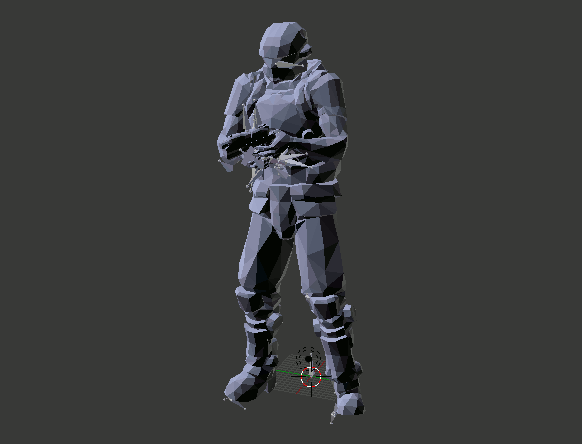

# md5-converter

## Description

Convert md5mesh and md5anim formats from version 6 to version 10.

## Usage

`java -jar md5-converter <input directory> <output directory>`

The **input directory** is a folder containing at least one md5mesh file and one or more md5anim files, and the **output directory** is the location that you want to write converted files to.

## Thank you

To Jack Henahan ([@jhenahan](https://github.com/jhenahan)) for introducing me to parsers and helping me understand the math.

## Notice

The matrix to quaternion conversion function in [Quaternion.scala](src/main/scala/com/mjsonofharry/md5model/math/Quaternion.scala) is ported from [NiPy](https://github.com/nipy/nibabel/blob/master/nibabel/quaternions.py).

The entirety of [Eig.scala](src/main/scala/com/mjsonofharry/md5model/math/Eig.scala) is modified from [Breeze](https://github.com/scalanlp/breeze/blob/master/math/src/main/scala/breeze/linalg/functions/eig.scala).

## Reference

[MD5Mesh and MD5Anim files formats](http://tfc.duke.free.fr/coding/md5-specs-en.html)

[Unofficial DoomIII model specs v0.1](https://www.doomworld.com/forum/topic/57897-alpha-shotgun-mod/?page=4&tab=comments#comment-1581404)

[EuclideanSpace - Mathematics and Computing](https://www.euclideanspace.com/)
